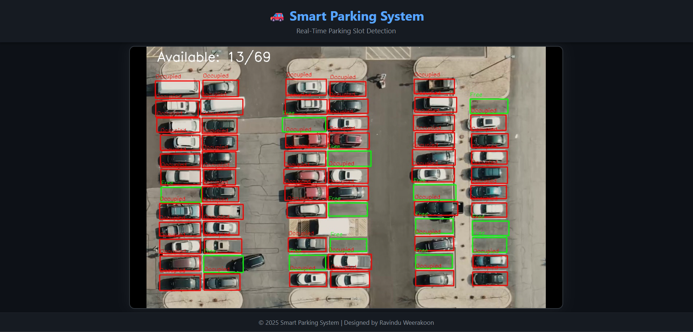

# 🚗 Smart Parking Slot Detection System

[](https://www.python.org/)
[](https://flask.palletsprojects.com/)
[](https://opencv.org/)
[](LICENSE)

A high-performance, real-time parking monitoring solution leveraging Computer Vision to detect slot occupancy. This project provides a complete pipeline from visual ROI calibration to a live web-streamed dashboard.

---

## 📸 Demo



---

## 🌟 Key Features

- **Real-Time Detection:** Live monitoring of parking slot occupancy with sub-second latency.
- **Robust Image Processing:** Multi-stage OpenCV pipeline for high accuracy in varying light conditions.
- **Interactive Calibration:** Visual tool to define parking slots (Regions of Interest) without manual coordinate entry.
- **Web-Based Dashboard:** Stream processed video directly to any browser via a Flask-powered MJPEG server.
- **Modular Architecture:** Clean separation between image processing logic, business rules, and the web interface.

---

## 🛠️ Technical Deep Dive

### 1. Image Preprocessing Pipeline
To ensure reliable detection, every frame undergoes a rigorous transformation process:
1.  **Grayscale Conversion:** Simplifies the image for intensity-based analysis.
2.  **Gaussian Blur:** (3x3 kernel) Reduces high-frequency noise and small artifacts.
3.  **Adaptive Thresholding:** (Gaussian C, Inverse) Dynamically adjusts to local lighting, highlighting edges and contours even in shadows.
4.  **Median Blur:** (5x5 kernel) Eliminates "salt and pepper" noise from the thresholded binary image.
5.  **Dilation:** (3x3 kernel) Thickens the detected features to make occupancy signals stronger and more consistent.

### 2. Occupancy Detection Algorithm
The system uses a sophisticated weighted approach to determine if a slot is occupied:
- **ROI Cropping:** Extracts the specific region defined during calibration.
- **Weighted Metric:** Calculates a `combined_area` score using the formula:
  $$CombinedArea = \frac{(WhitePixels \times 2) + ContourArea}{3}$$
  This balances total pixel intensity with structural contour data for higher reliability.
- **Hysteresis Thresholding:**
  - **Occupied:** `CombinedArea > 1000`
  - **Free:** `CombinedArea < 800`
  - *Prevents rapid switching (flickering) when values are near the threshold.*
- **Temporal Smoothing:** A 5-frame moving window (using `collections.deque`) applies a majority vote logic to ensure the status only changes when the detection is stable.

---

## 🗂️ Project Structure

```plaintext
parking-lot-monitoring-opencv/
├── app.py                      # Flask web server & MJPEG streamer
├── environment.yml             # Conda environment configuration
├── backend_image_processing/
│   ├── detector.py             # Main detection generator logic
│   ├── calibrate.py            # Visual ROI calibration tool
│   └── utils/                  # Core utility modules
│       ├── business_logic.py   # Occupancy algorithms & smoothing
│       ├── image_preprocess.py # OpenCV preprocessing pipeline
│       ├── draw_overlays.py    # UI overlay rendering
│       ├── encoder.py          # MJPEG frame encoding
│       └── load.py             # Resource management
├── data/
│   └── rois.json               # Persisted parking slot coordinates
├── video/
│   └── carPark.mp4             # Source video footage
├── templates/
│   └── index.html              # Responsive web dashboard
└── static/
    └── style.css               # Modern UI styling
```

---

## 🚀 Getting Started

### 1. Installation
Ensure you have [Conda](https://docs.conda.io/en/latest/) installed.

```bash
# Clone the repository
git clone https://github.com/Ravindu-Sampath-Weerakoon/parking-lot-monitoring-opencv.git
cd parking-lot-monitoring-opencv

# Create and activate environment
conda env create -f environment.yml
conda activate parking_env
```

### 2. ROI Calibration
If you want to use a different video or redefine slots:
```bash
python backend_image_processing/calibrate.py
```
- **Usage:** Drag and select rectangles for each parking slot.
- **Save:** Press `ENTER` to save the coordinates to `data/rois.json`.

### 3. Run the Application
```bash
python app.py
```
Visit **[http://127.0.0.1:5000](http://127.0.0.1:5000)** to view the live detection feed.

---

## ⚙️ Configuration & Customization

- **Thresholds:** Adjust `white_pixel_thresh_free` and `white_pixel_thresh_occupied` in `detector.py` to tune sensitivity.
- **Video Source:** Update the `video_path` in `detector.py` or `calibrate.py` to point to your own footage.
- **Smoothing:** Change `history_size` in `generate_detected_frames` to increase or decrease detection lag vs. stability.

---

## 📈 Future Enhancements

- [ ] Integration with IP Camera streams (RTSP/RTMP).
- [ ] Database logging for parking usage statistics and heatmaps.
- [ ] Mobile application for real-time slot booking.
- [ ] Advanced Deep Learning (YOLO/SSD) for vehicle type classification.

---

## ✨ About the Author

**Ravindu Weerakoon**  
Passionate about Computer Vision and Intelligent Systems.  
*For educational and research purposes.*

---

## 📄 License

Distributed under the Educational License. See `LICENSE` (if applicable) for more information.
